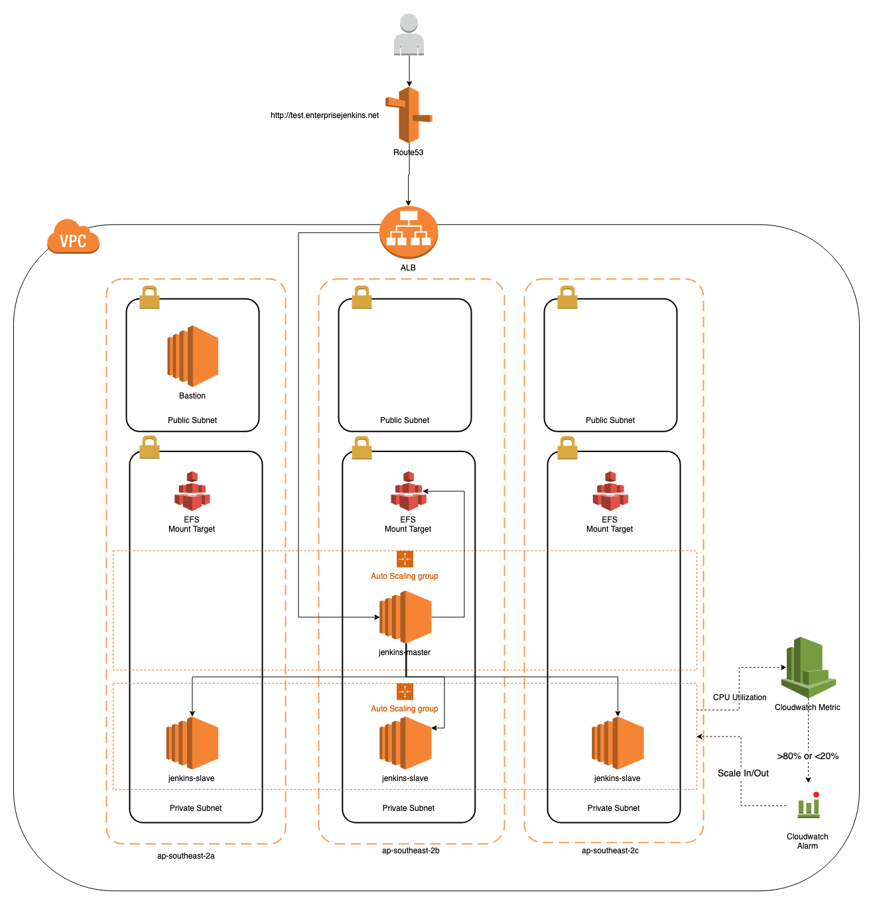

# terraform-vpc-jenkins

Code developed to provision the base infrastructure required to deploy a mock enterprise jenkins

This repository stores terraform code which provisions the following resources:

- VPC
- Subnets
- Route Tables and Routes
- Bastion Host

The reference architecture for the mock enterprise Jenkins can be found below

## Jenkins Master

<https://github.com/shoryec/terraform-jenkins-master>

## Jenkins Slaves

<https://github.com/shoryec/terraform-jenkins-slaves>

## Jenkins Pipeline

<https://github.com/shoryec/jenkins-pipeline-example>
